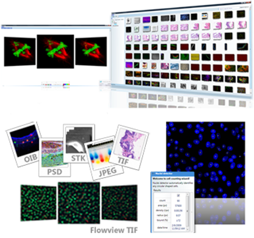

# Imago

Mayachitra's BioImage Management and Analysis Software
  

_Imago_ is an advanced image database and analysis system designed for managing microscopic images. _Imago_ integrates flexible annotation and metadata management with advanced image analysis tools. _Imago_ is simple yet powerful tools that allows scientists to easily manage, organize, analyze a large collection of images. _Imago_ provides a powerful unified search functionality that enables you to search images in one place by image name, annotation, your own tags, image content, or any combination of the above.  

Mayachitra's _Imago_ is an advanced desktop image management package that enables scientists to easily store, manage, search, and analyze 5D biological images and their analysis results. _Imago_ also integrates flexible annotation and metadata management with advanced image analysis tools.

## Software Requirements

Version: 1.0.104.1291  
Release: July 11, 2010  
Operating Systems supported: Windows Vista, Windows, Windows 7, Windows XP  
Additional Requirements: Microsoft .NET Framework 3.5

## Contact Us
Mayachitra, Inc  
5266 Hollister Ave, Suite 229, Santa Barbara, CA, 93111  
Phone: +1 (805)-967-9828  
Have more questions? Write to us by filling in this <a href="https://mayachitra.com/#contact-us">form</a>

## License

_Imago_ is released under GPL-3.0 License.

Copyright © 2021 [Mayachitra, Inc.](https://mayachitra.com/)

